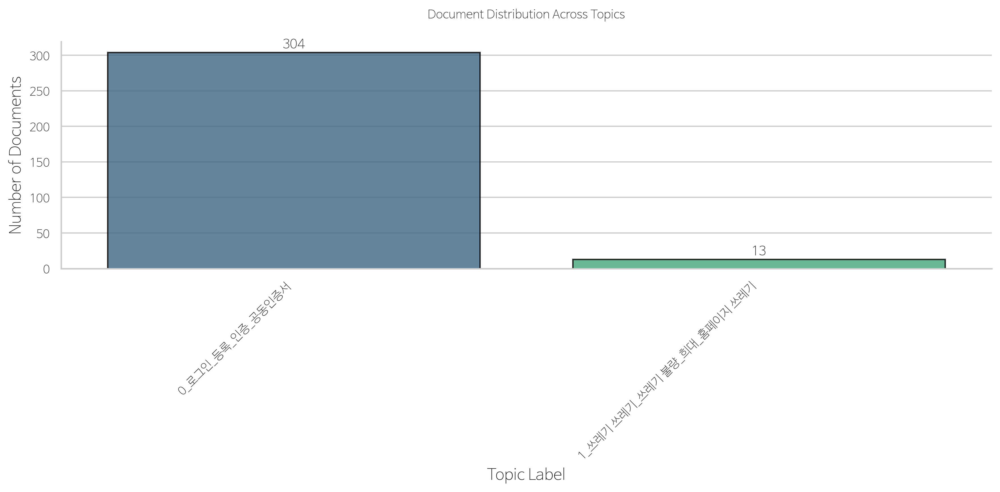
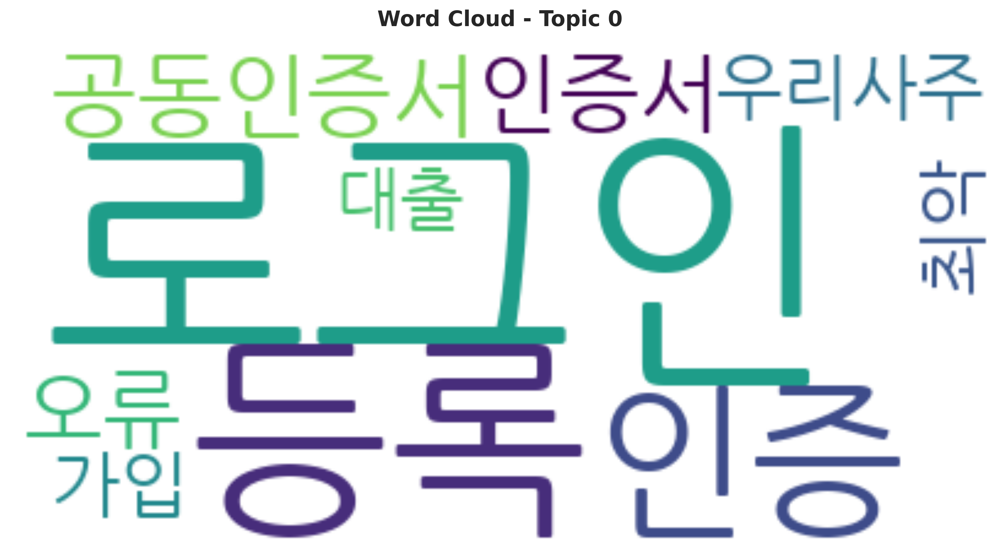

# Korean App Review Analysis: Topic Modeling & Sentiment Analysis

[](https://www.python.org/)
[](https://maartengr.github.io/BERTopic/)
[](LICENSE)

**Author**: Yongjun (Andrew) Lee  
**Organization**: Korea Securities Finance Corporation (KSFC)

---

## 🇺🇸 English

### Project Overview

This project combines **BERTopic-based topic modeling** with **sentiment analysis** to analyze Korean mobile banking app reviews from **Google Play Store** and **Apple App Store**. The dual-analysis approach identifies key themes in user feedback while quantifying emotional sentiment, enabling data-driven UX improvements and strategic decision-making for financial mobile applications.

### Key Components

| Component | Technology | Purpose |
|-----------|------------|---------|
| Text Processing | Komoran (KoNLPy) | Korean morphological analysis |
| Embeddings | paraphrase-multilingual-MiniLM-L12-v2 | Multilingual sentence embeddings |
| Dimensionality Reduction | UMAP | 384 → 5 dimensions |
| Clustering | HDBSCAN | Density-based topic discovery |
| Topic Representation | c-TF-IDF | Extract representative keywords |
| Sentiment Analysis | Custom Polarity Scoring | Quantify emotional tone per review |

### Results

The analysis discovered **2 distinct topics** from 317 processed reviews:

| Topic | Documents | Keywords | Interpretation |
|-------|-----------|----------|----------------|
| **Topic 0** | 304 (96%) | 로그인, 등록, 인증, 공동인증서, 오류 | Functional Issues (Authentication/Login UX) |
| **Topic 1** | 13 (4%) | 쓰레기, 불량, 희대 | Extreme Negative Feedback |

### Visualizations

#### Document Distribution Across Topics


#### Word Clouds

<table>
<tr>
<td><strong>Topic 0: Authentication Issues</strong></td>
<td><strong>Topic 1: Extreme Complaints</strong></td>
</tr>
<tr>
<td></td>
<td></td>
</tr>
</table>

#### Comprehensive Topic Summary


#### Sentiment Analysis


#### Sentiment by Topic


#### Topic-Sentiment Heatmap
Interactive visualization available: `result/topic_sentiment_heatmap.html`

### Key Findings

1. **Authentication Pain Points**: The dominant topic (96% of reviews) centers on login, certificate registration, and authentication errors. Users frequently mention "무한 로그인" (infinite login loops) and certificate-related frustrations.

2. **Sentiment Correlation**: Topic 0 (functional issues) shows lower average sentiment (0.116) compared to Topic 1 (0.316), indicating that specific technical complaints correlate with more negative overall sentiment.

3. **Actionable Insights**: 
   - Streamline certificate registration workflow
   - Need to reduce repeated authentication
   - Address app performance issues (buffering, loading times)

### Project Structure

```
korean-app-review-nlp/
├── data/
│   └── all_reviews.xlsx          # Raw review data (Google Play + App Store)
├── result/
│   ├── bertopic_topic_info.csv   # Topic summary
│   ├── bertopic_document_topics.csv
│   ├── bertopic_barchart.html    # Interactive visualization
│   ├── bertopic_heatmap.html
│   ├── topic_sentiment_heatmap.html
│   ├── wordcloud_topic_*.png
│   ├── sentiment_*.png           # Sentiment visualizations
│   └── comprehensive_topic_summary.png
├── Analyze_App_Reviews.ipynb
├── stop_words_list.txt
├── dictionary.txt                # Custom Komoran dictionary
└── README.md
```

### Installation

```bash
# Clone the repository
git clone https://github.com/yourusername/korean-app-review-nlp.git
cd korean-app-review-nlp

# Install dependencies
pip install bertopic sentence-transformers umap-learn hdbscan
pip install konlpy pandas numpy plotly wordcloud
pip install "scipy<1.13"  # Compatibility fix
```

### Usage

```python
from bertopic import BERTopic
from umap import UMAP
from hdbscan import HDBSCAN

# Configure models with fixed random state for reproducibility
umap_model = UMAP(n_neighbors=15, n_components=5, random_state=42)
hdbscan_model = HDBSCAN(min_cluster_size=10, min_samples=5)

# Initialize BERTopic
topic_model = BERTopic(
    embedding_model='paraphrase-multilingual-MiniLM-L12-v2',
    umap_model=umap_model,
    hdbscan_model=hdbscan_model,
    nr_topics='auto',
    language='multilingual'
)

# Fit and transform
topics, probs = topic_model.fit_transform(docs)
```

### Technical Highlights

- **Reproducibility**: Fixed `random_state=42` in UMAP ensures consistent results across runs
- **Korean NLP**: Custom Komoran dictionary for financial domain terminology (공동인증서, 금융인증서, etc.)
- **Domain Normalization**: Regex-based text preprocessing unifies variant spellings

### Limitations

- Dataset is heavily skewed toward 1-star and 5-star reviews (polarized distribution)
- Small sample size (317 documents) limits topic granularity
- Korean morphological analysis may miss some compound terms

---

## 🇰🇷 한국어

### 프로젝트 개요

본 프로젝트는 **BERTopic 기반 토픽 모델링**과 **감성 분석**을 결합하여 **Google Play Store**와 **Apple App Store**의 한국 금융 모바일 앱 리뷰를 분석합니다. 이중 분석 접근법을 통해 사용자 피드백의 핵심 주제를 식별하고 감정적 감성을 정량화하여, 데이터 기반의 UX 개선 및 전략적 의사결정을 지원합니다.

### 주요 구성 요소

| 구성 요소 | 기술 | 용도 |
|-----------|------|------|
| 텍스트 처리 | Komoran (KoNLPy) | 한국어 형태소 분석 |
| 임베딩 | paraphrase-multilingual-MiniLM-L12-v2 | 다국어 문장 임베딩 |
| 차원 축소 | UMAP | 384 → 5차원 |
| 클러스터링 | HDBSCAN | 밀도 기반 토픽 발견 |
| 토픽 표현 | c-TF-IDF | 대표 키워드 추출 |
| 감성 분석 | Custom Polarity Scoring | 리뷰별 감정 톤 정량화 |

### 분석 결과

317개의 처리된 리뷰에서 **2개의 토픽**이 발견되었습니다:

| 토픽 | 문서 수 | 핵심 키워드 | 해석 |
|------|---------|-------------|------|
| **토픽 0** | 304 (96%) | 로그인, 등록, 인증, 공동인증서, 오류 | 기능적 이슈 (인증/로그인 UX) |
| **토픽 1** | 13 (4%) | 쓰레기, 불량, 희대 | 극단적 부정 피드백 |

### 시각화 결과

#### 토픽별 문서 분포


#### 워드 클라우드

<table>
<tr>
<td><strong>토픽 0: 인증 관련 이슈</strong></td>
<td><strong>토픽 1: 극단적 불만</strong></td>
</tr>
<tr>
<td></td>
<td></td>
</tr>
</table>

#### 종합 토픽 요약


#### 감성 분석


#### 토픽별 감성 분석


#### 토픽-감성 히트맵
인터랙티브 시각화: `result/topic_sentiment_heatmap.html`

### 핵심 발견사항

1. **인증 프로세스 Pain Point**: 전체 리뷰의 96%가 로그인, 인증서 등록, 인증 오류에 집중되어 있습니다. 사용자들은 "무한 로그인", 인증서 관련 불편함을 빈번하게 언급합니다.

2. **감성 상관관계**: 토픽 0(기능적 이슈)은 토픽 1(0.316)에 비해 낮은 평균 감성 점수(0.116)를 보여, 구체적인 기술적 불만이 더 부정적인 감성과 연관됨을 나타냅니다.

3. **개선 제안**: 
   - 인증서 등록 워크플로우 간소화
   - 반복 인증 감소 필요
   - 앱 성능 이슈(버퍼링, 로딩 시간) 해결

### 기술적 특징

- **재현성**: UMAP에 `random_state=42` 고정으로 실행 시마다 동일한 결과 보장
- **한국어 NLP**: 금융 도메인 용어를 위한 Komoran 사용자 사전 구축 (공동인증서, 금융인증서 등)
- **도메인 정규화**: 정규식 기반 텍스트 전처리로 변형 철자 통일

### 한계점

- 데이터셋이 1점/5점 리뷰에 편중되어 있음 (양극화된 분포)
- 표본 크기(317개 문서)가 작아 토픽 세분화에 제한
- 한국어 형태소 분석 시 일부 복합어 누락 가능

---

## License

This project is licensed under the MIT License - see the [LICENSE](LICENSE) file for details.

## Acknowledgments

- [BERTopic](https://maartengr.github.io/BERTopic/) by Maarten Grootendorst
- [KoNLPy](https://konlpy.org/) for Korean NLP tools
- Korea Securities Finance Corporation (KSFC) for supporting this research

## Contact

**Yongjun (Andrew) Lee**  
- GitHub: [@yourusername](https://github.com/yourusername)
- Organization: Korea Securities Finance Corporation (KSFC)
